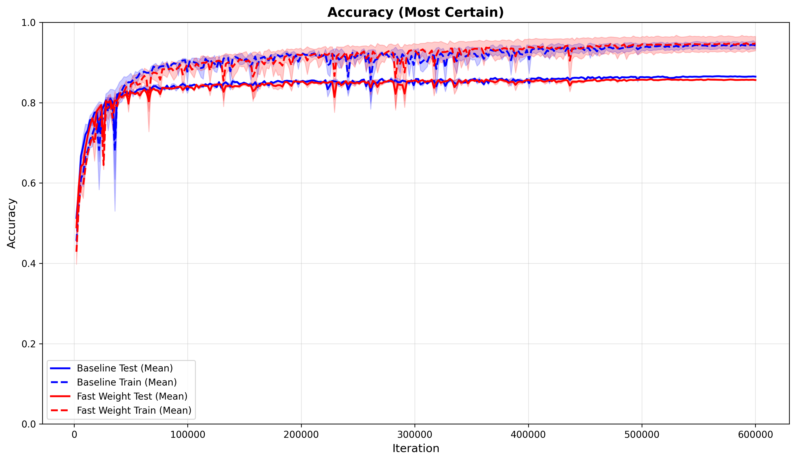
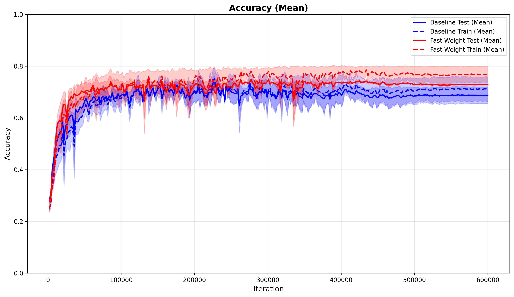
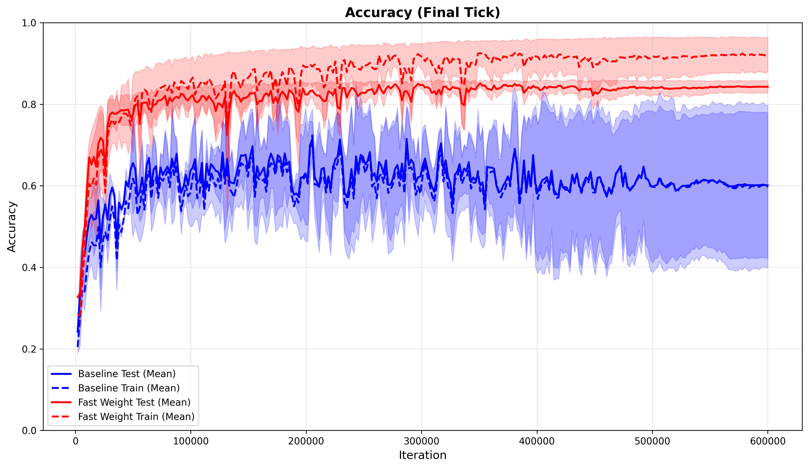
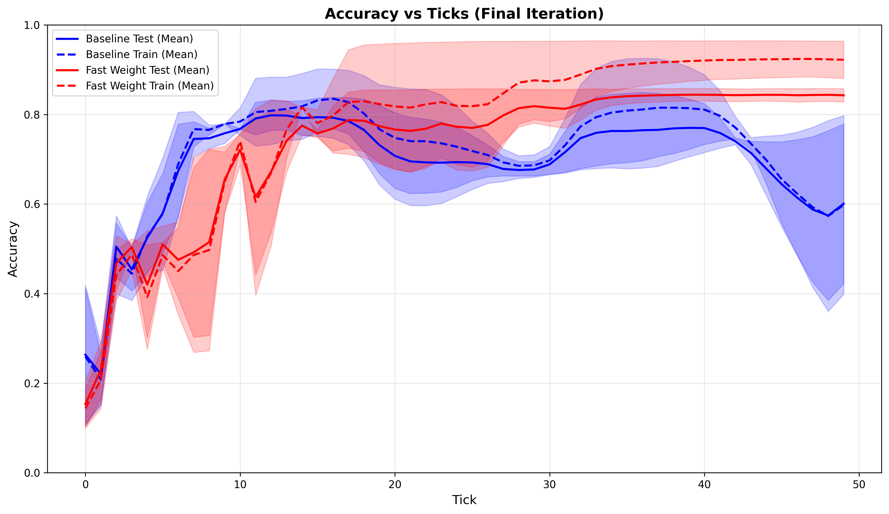

# Plastic Continuous Thought Machines

This repository extends the original Continuous Thought Machine (CTM) with hypernetwork support, enabling dynamic weight adjustment based on input state.

## Acknowledgments

This project is based on the original [Continuous Thought Machines](https://github.com/SakanaAI/continuous-thought-machines) repository by SakanaAI. We thank the original authors for their excellent work.

## Motivation: Dynamic Weights for Plasticity

Standard recurrent neural networks, including the original CTM, use fixed weight matrices during inference. This means their processing rules remain static regardless of input changes or thought process evolution, lacking a mechanism to dynamically adapt to context changes.

In contrast, the human brain exhibits **Short-Term Plasticity (STP)**, where synaptic connections undergo continuous dynamic changes not only during long-term learning but also across short timescales (seconds to minutes) during thought and inference. The neocortex dynamically alters transmission efficiency based on recent activity history, functioning like filters that adaptively process information based on context.

This implementation brings similar dynamic weight capabilities to CTM, allowing the model to autonomously switch information-processing modes based on the current state.

## Key Differences

The main enhancements are the implementations of:
- **`HyperSynapseUNET`** (see `models/modules.py:221-222`): Hypernetwork support for Synapse modules
- **`HyperSuperLinear`** (see `models/modules.py:506`): Hypernetwork support for Neuron-Level Models (NLM)

Both allow you to optionally use hypernetworks via command-line arguments.

### What This Enables

#### Synapse Hypernetworks
- **Optional hypernetwork usage**: Control whether to use hypernetworks through the `--use_hyper` flag and `--hyper_layers` argument
- **Flexible layer selection**: Choose which layers to apply hypernetworks to:
  - `'none'`: No hypernetwork (equivalent to original CTM)
  - `'bottleneck'`: Only bottleneck layers (recommended)
  - `'down'`: All down projection layers
  - `'up'`: All up projection layers
  - `'all'`: All layers

#### NLM Hypernetworks
- **Neuron-Level Model hypernetworks**: Apply hypernetworks to NLM modules via `--use_hyper_nlm` flag
- **Adaptive temporal dynamics**: Each neuron's update rule can be dynamically adjusted based on current state
- **Shared hypernetwork**: All neurons share the same hypernetwork for parameter efficiency

#### Backward Compatibility
Setting `hyper_layers='none'` and omitting `--use_hyper` and `--use_hyper_nlm` results in the same behavior as the original CTM.

### Mathematical Formulation

The dynamic weight mechanism works by adding a context-dependent component to the base weights:

```
W_t = W_base + ΔW(z_t)
```

where:
- `W_base` is the fixed base weight matrix
- `ΔW(z_t)` is the dynamic component that depends on the input `z_t` at time `t`

To reduce computational cost, we use a **low-rank approximation**:

```
ΔW(z_t) = U(φ(z_t)) · V(φ(z_t))^T
```

where:
- `φ` is a context compressor (single-layer MLP with Layer Normalization) that transforms `z_t` into a lower-dimensional representation
- `U` and `V` are linear layers that generate the low-rank matrices from the compressed context
- The rank is controlled by the `hyper_rank` parameter (typically 4-16)

This low-rank decomposition significantly reduces memory requirements while maintaining the ability to adapt weights dynamically.

### Implementation Details

The `HyperContinuousThoughtMachine` class inherits from `ContinuousThoughtMachine` and adds:
- **Synapse hypernetwork parameters**:
  - `hyper_layers`: Controls which layers use hypernetworks
  - `hyper_rank`: LoRA rank for the hypernetwork decomposition
- **NLM hypernetwork parameters**:
  - `use_hyper_nlm`: Boolean flag to enable NLM hypernetworks
  - `hyper_nlm_rank`: LoRA rank for NLM hypernetwork decomposition

**Architecture Components:**
- **Context Compressor (`φ`)**: A single-layer MLP with Layer Normalization that compresses the input state into a lower-dimensional representation
- **Hypernetwork Heads (`U`, `V`)**: Linear layers that generate the low-rank weight matrices from the compressed context
- **Gate Mechanism**: Optional learnable gating that controls the strength of the dynamic component

**Layer Selection Strategy:**
To balance expressiveness and parameter efficiency, hypernetworks can be applied selectively:
- **Bottleneck layers** (recommended): Applied only to the central layers where information is most compressed, providing maximum impact with minimal parameter overhead
- **All layers**: Maximum expressiveness but higher computational cost

This design allows seamless switching between standard CTM and hypernetwork-enhanced CTM (for both Synapse and NLM) without code changes, simply by adjusting command-line arguments.

## CIFAR-10 Training Examples

### Standard CTM (Baseline)

```bash
python -m tasks.image_classification.train \
    --model ctm \
    --dataset cifar10 \
    --log_dir logs/cifar10/ctm-baseline \
    --d_model 256 \
    --d_input 64 \
    --synapse_depth 5 \
    --heads 16 \
    --n_synch_out 256 \
    --n_synch_action 512 \
    --n_random_pairing_self 0 \
    --neuron_select_type random-pairing \
    --iterations 50 \
    --memory_length 15 \
    --deep_memory \
    --memory_hidden_dims 64 \
    --dropout 0.0 \
    --dropout_nlm 0 \
    --no-do_normalisation \
    --positional_embedding_type none \
    --backbone_type resnet18-1 \
    --training_iterations 600001 \
    --warmup_steps 1000 \
    --use_scheduler \
    --scheduler_type cosine \
    --weight_decay 0.0001 \
    --save_every 1000 \
    --track_every 2000 \
    --n_test_batches 50 \
    --num_workers_train 8 \
    --batch_size 512 \
    --batch_size_test 512 \
    --lr 1e-4 \
    --device 0 \
    --seed 1
```

### HyperCTM with Synapse Hypernetworks (Bottleneck)

```bash
python -m tasks.image_classification.train \
    --model ctm \
    --use_hyper \
    --hyper_layers bottleneck \
    --hyper_rank 8 \
    --dataset cifar10 \
    --log_dir logs/cifar10/hyperctm-bottleneck \
    --d_model 256 \
    --d_input 64 \
    --synapse_depth 5 \
    --heads 16 \
    --n_synch_out 256 \
    --n_synch_action 512 \
    --n_random_pairing_self 0 \
    --neuron_select_type random-pairing \
    --iterations 50 \
    --memory_length 15 \
    --deep_memory \
    --memory_hidden_dims 64 \
    --dropout 0.0 \
    --dropout_nlm 0 \
    --no-do_normalisation \
    --positional_embedding_type none \
    --backbone_type resnet18-1 \
    --training_iterations 600001 \
    --warmup_steps 1000 \
    --use_scheduler \
    --scheduler_type cosine \
    --weight_decay 0.0001 \
    --save_every 1000 \
    --track_every 2000 \
    --n_test_batches 50 \
    --num_workers_train 8 \
    --batch_size 512 \
    --batch_size_test 512 \
    --lr 1e-4 \
    --device 0 \
    --seed 1
```

### HyperCTM with Both Synapse and NLM Hypernetworks

```bash
python -m tasks.image_classification.train \
    --model ctm \
    --use_hyper \
    --hyper_layers bottleneck \
    --hyper_rank 8 \
    --use_hyper_nlm \
    --hyper_nlm_rank 4 \
    --dataset cifar10 \
    --log_dir logs/cifar10/hyperctm-full \
    --d_model 256 \
    --d_input 64 \
    --synapse_depth 5 \
    --heads 16 \
    --n_synch_out 256 \
    --n_synch_action 512 \
    --n_random_pairing_self 0 \
    --neuron_select_type random-pairing \
    --iterations 50 \
    --memory_length 15 \
    --deep_memory \
    --memory_hidden_dims 64 \
    --dropout 0.0 \
    --dropout_nlm 0 \
    --no-do_normalisation \
    --positional_embedding_type none \
    --backbone_type resnet18-1 \
    --training_iterations 600001 \
    --warmup_steps 1000 \
    --use_scheduler \
    --scheduler_type cosine \
    --weight_decay 0.0001 \
    --save_every 1000 \
    --track_every 2000 \
    --n_test_batches 50 \
    --num_workers_train 8 \
    --batch_size 512 \
    --batch_size_test 512 \
    --lr 1e-4 \
    --device 0 \
    --seed 1
```

### Key Hypernetwork Parameters

- `--use_hyper`: Enable Synapse hypernetworks
- `--hyper_layers`: Choose which layers to hyperize (`bottleneck`, `down`, `up`, `all`, or `none`)
- `--hyper_rank`: LoRA rank for Synapse hypernetworks (typically 4-16)
- `--use_hyper_nlm`: Enable NLM hypernetworks
- `--hyper_nlm_rank`: LoRA rank for NLM hypernetworks (typically 4-8)

For a fair comparison with the baseline, you may want to increase `--d_model` to match the additional parameters introduced by the hypernetwork.

## Results

We evaluate the proposed HyperCTM method on CIFAR-10 image classification and compare it with the baseline CTM. The results demonstrate the advantages of dynamic weight adjustment for maintaining stable performance over extended thought processes.

### Learning Trajectories

The following figures compare learning trajectories for various accuracy metrics:


*Most Certain Accuracy comparison between baseline and proposed methods.*


*Average accuracy across all ticks comparison.*


*Accuracy at the final tick comparison.*


*Learning trajectories over training iterations.*

### Key Findings

1. **Most Certain Accuracy**: The baseline and proposed methods show almost no difference, with the baseline slightly outperforming (86.5% vs 85.6%). This indicates that both methods can achieve similar peak performance when selecting predictions based on confidence.

2. **Average and Final Tick Accuracy**: The proposed method demonstrates superior test performance for both average accuracy across all ticks and accuracy at the final tick. This improvement is particularly significant at the final tick, where the baseline method shows unstable and declining performance.

3. **Stability**: The baseline method is vulnerable to performance degradation with prolonged thought processes due to fixed weights. In contrast, the proposed method remains stable and even improves performance over time by using dynamic weight adjustments to handle increasing complexity.

### Quantitative Results

**Table 1: Comparison of test accuracy and ECE at the most certain tick and the final tick.**

| Method    | At most certain             | At final tick               |
| :-------- | :-------------------------- | :-------------------------- |
| **Baseline**  | ACC: 86.5±0.1 ECE: 0.12±0.00 | ACC: 60.0±17.8 ECE: 0.26±0.15 |
| **Proposed**  | ACC: 85.6±0.1 ECE: 0.13±0.00 | ACC: 84.3±1.5 ECE: 0.10±0.01  |

### Discussion

The results highlight several important advantages of the proposed approach:

- **Better Calibration**: While the original CTM's most certain prediction might favor the baseline, relying solely on confidence can negatively impact calibration. The proposed method at the final tick achieves a better ECE than the baseline at the most certain tick (0.10 vs 0.12), while maintaining competitive accuracy.

- **Robustness**: The proposed method maintains high accuracy (84.3%) at the final tick with low variance (1.5), compared to the baseline's unstable performance (60.0% with high variance of 17.8). This demonstrates the robustness of dynamic weight adjustment for extended reasoning processes.

- **Out-of-Distribution Generalization**: Confidence-based predictions can be hazardous for OOD generalization. The proposed method's ability to maintain stable performance across all ticks makes it more reliable for real-world applications where the distribution of complexity may vary.
